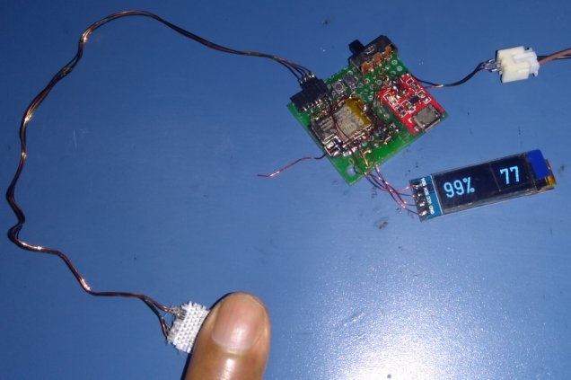
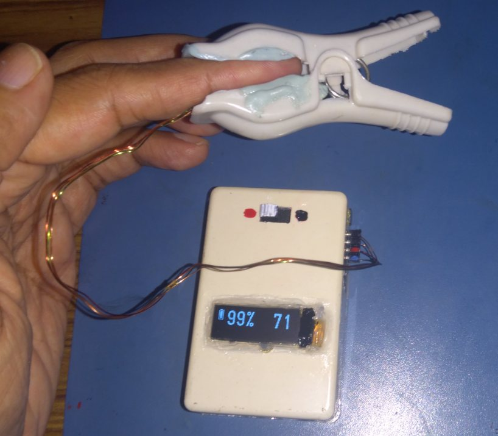
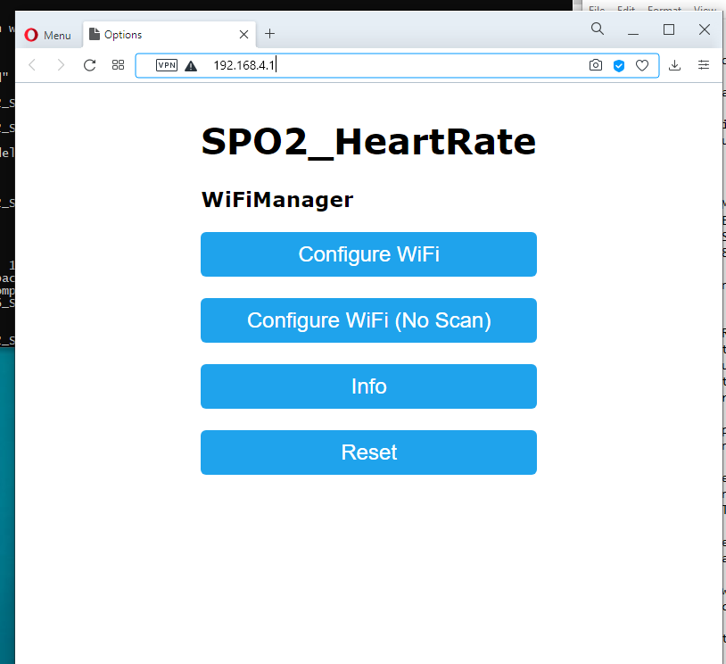
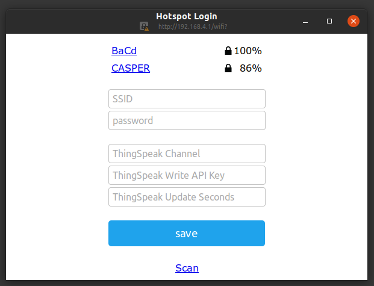

# ESP8266_SPO2_PULSE_LOGGER

The ESP8266 collects raw sensor data from a MAX30102 
sensor, analyzes it and computes SP02 and heart-rate (bpm) readings, every 5 seconds. 

A 128x32 OLED display is used to indicate SPO2 and heart-rate.

The readings are published (with a configurable update interval) to your 
channel on the IOT website Thingspeak. 
You can view a 'real-time' chart of the data on your channel page.

Internet Access Point SSID/PW, ThingSpeak credentials and update interval are
configured via an AP web portal that is available on-demand by pressing a
configuration button after power-up.

## Development Environment

* ESP8285 (ESP8266 with on-chip 1MB flash)
* 128x32 OLED display
* MCP73831 Lipoly charger
* 1000mAh Lipoly battery
* Home-brew MAX30102 breakout board. Modules are available on AliExpress.
* Arduino 1.8.13 on Ubuntu 20.04 amdx64

## Prototype Hardware

Here's the [circuit schematic](sp02_pulse_logger_schematic.pdf).

## Completed Unit

I used a clothes peg with some silicone putty to make a mold for my index finger. If blood circulation
is restricted, you won't be able to get any readings. So I bent back the clothes peg
spring to reduce the closing force to the point where it was just enough to allow a snug fit. 

## Library Usage Notes

* MAX30102 sensor initialization and FIFO readout code from 
[Sparkfun](https://github.com/sparkfun/SparkFun_MAX3010x_Sensor_Library)

* SPO2 & pulse rate measurement code by Robert Fraczkiewicz from 
[aromring's repository](https://github.com/aromring/MAX30102_by_RF). 
I tweaked RF's implementation to use a 125 sample buffer. 

* WiFiManager SSID/password and ThingSpeak configuration magic by [tzapu](https://github.com/tzapu/WiFiManager)

* [Arduino Json 5 library](https://github.com/bblanchon/ArduinoJson/tree/5.x). Note that
the Json 6 library uses a completely different API.

* [U8G2lib Arduino graphics library](https://github.com/olikraus/U8g2_Arduino)

* [ThingSpeak Arduino library](https://github.com/mathworks/thingspeak-arduino)

## RF auto-correlation algorithm versus FFT spectral analysis - a diversion

I've [archived some code](RFA_versus_FFT_for_heartrate.zip) that does an 
FFT spectral analysis of the sensor red led waveform to determine the heart-rate. 

## Usage

* The ESP8285 has 1MByte of on-chip flash memory. I had problems flashing the chip when
I selected "generic ESP8285" in the Arduino IDE. So I ended up selecting "generic ESP8266", 
(1MB with 64kB SPIFFS). If you are
using a regular ESP8266, choose a similar option (xMB with 64kB SPIFFS).
* When flashing the first time, select the IDE flash "erase all" option to erase any existing
SPIFFS partitions and Wifi settings. Flash the application and then revert to "erase sketch only".
Do this if you make any changes to the SPIFFS partition, configuration file structure, or are facing problems with IAP access after configuration.
* The ESP8266 reads a JSON configuration file in SPIFFS to retrieve the Thingspeak
parameters (channel number, write API key and update interval). If you used the
"erase all" flash option, the configuration file will not exist and the AP configuration portal will start up.
Connect to the WiFi access point with SSID "SPO2_HeartRate" within 90 seconds. On my
Ubuntu 20.04 machine, the configuration webpage automatically popped up in a separate browser window.
If that doesn't happen, open your browser and enter the url http://192.168.4.1 to access the Wifi configuration page. Here you enter the 
Internet access point SSID/password, the Thingspeak channel number, API key and update interval (in seconds). The **minimum update interval** for a free ThingSpeak subscription is 15 seconds.
Save the settings. The ThingSpeak parameters will now be saved to a JSON configuration file
in SPIFFS. The IAP SSID and password are saved in the Wifi settings flash area.

### Portal home page

### Portal configuration page (with flash completely erased)

* If you want to change the Internet Access point configuration SSID/PW or Thingspeak
credentials, start the AP portal by pressing the configuration button
when you see the display prompt, just after power-up. Keep it pressed until you
see confirmation of the portal startup.
Now connect to the portal and make your changes.

* Battery and WiFi status are shown in the left side of the display. If the unit cannot
connect to the last configured IAP, or cannot connect to ThingSpeak with 3 consecutive attempts, 
the Wifi radio is turned off and no WiFi icon will be displayed.

## Power management

With OLED display and WiFi on, the average current draw is ~75mA. With OLED display on and WiFi off, the average current draw
is ~30mA. 
To save power, the unit turns on the WiFi only when publishing an update to
the ThingSpeak website - this takes about 4-5 seconds.

Apparently, if you configure the unit with a static IP address in station mode, connecting
to the access point is faster. That would shorten the time required to publish an update.
But not all access points allow static configuration of IP
addresses - e.g. my phone in hotspot mode does not.

## Recoverable fault handling

* If unable to connect to the configured internet access point, the unit will disable
internet access and continue sensor sampling with OLED display of SPO2 and heart-rate.
* If unable to connect to the ThingSpeak website to publish updates with 3 consecutive
attempts, the unit will disable internet access
and continue sensor sampling with OLED display of SPO2 and heart-rate.

## Unrecoverable fault handling

The following error conditions are handled by 
shutting down the MAX30102 sensor, turning off the OLED display and switching the ESP8285 
into deep sleep mode.
This is done to save battery power. To recover, switch the unit off and on again. 

* Battery voltage is too low
* Unable to connect to or configure the MAX30102 sensor on power up
* Unable to detect valid SPO2/pulse readings for 1 minute

