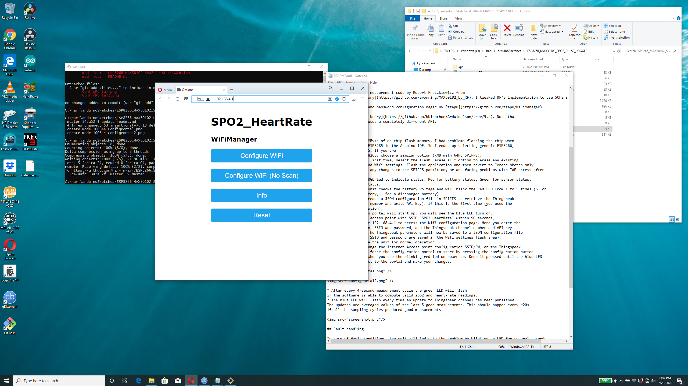

# ESP8266_MAX30102_SPO2_PULSE_LOGGER

The ESP8266 collects raw sensor data from a MAX30102 
sensor, analyzes it and computes SP02 and heart-rate (bpm) readings, every 4 seconds. 
The last 5 good readings are averaged and published (along with the battery voltage) to your 
channel on the IOT website Thingspeak.

## Development Environment

* Protoype board with ESP8285 (ESP8266 with on-chip 1MB flash), MCP73831 Lipoly charger, 500mAh Lipoly battery.
* Home-brew MAX30102 breakout board. Modules are available on AliExpress.
* Arduino 1.8.12 on Ubuntu 20.04 amdx64

## Prototype

## Credits

* MAX30102 sensor initialization and FIFO readout code from 
[Sparkfun](https://github.com/sparkfun/SparkFun_MAX3010x_Sensor_Library)

* SPO2 & pulse rate measurement code by Robert Fraczkiewicz from 
[aromring's repository](https://github.com/aromring/MAX30102_by_RF). I tweaked RF's implementation to use 50Hz sample rate. 

* WiFiManager SSID and password configuration magic by [tzapu](https://github.com/tzapu/WiFiManager)

* [Arduino Json 5 library](https://github.com/bblanchon/ArduinoJson/tree/5.x). Note that
the Json 6 library uses a completely different API.

## Usage

* The ESP8285 has 1MByte of on-chip flash memory. I had problems flashing the chip when
I selected generic ESP8285 in the Arduino IDE. So I ended up selecting generic ESP8266, 
1MB with 64kB SPIFFS. If you are
using a regular ESP8266, choose a similar option (xMB with 64kB SPIFFS).
* When flashing the first time, select the flash "erase all" option to erase any existing
SPIFFS partitions and Wifi settings. Flash the application and then revert to "erase sketch only".
Do this if you make any changes to the SPIFFS partition, or are facing problems with IAP access after
configuration.
* The unit uses an RGB led to indicate status. Red for battery status, Green for sensor status,
Blue for internet status.
* On power up, the unit checks the battery voltage and will blink the Red LED from 1 to 5 times (5 for
a fully charged battery, 1 for a discharged battery).
* The ESP8285 then reads a JSON configuration file in SPIFFS to retrieve the Thingspeak
parameters (channel number and write API key). If this is the first time (you used the
'erase all' flash option),
the AP configuration portal will start up. You will see the blue LED turn on.
Connect to the WiFi access point with SSID "SPO2_HeartRate" within 90 seconds,
and open the webpage 192.168.4.1 to access the Wifi configuration page. Here you enter the 
Internet access point SSID and password, and the Thingspeak channel number and API key.
Save the settings. The Thingspeak parameters will now be saved to a JSON configuration file
in SPIFFS. (The IAP SSID and password are saved in the Wifi settings flash area).
Reset or power cycle the unit for normal operation. 
* If you want to change the Internet Access point configuration SSID/PW, or the Thingspeak
parameters, you can force the configuration portal to start by pressing the configuration button
connected to GPIO0 when you see the blinking red led on power-up. Keep it pressed until the blue LED
turns on. Now connect to the portal and make your changes.

* After every 4-second measurement cycle the green LED will flash 
if the software is able to compute valid spo2 and heart-rate readings. 
* The blue LED will flash every time an update to Thingspeak channel has been published. 
The updates are averaged values of the last 5 good measurements. This should happen every ~20s 
if all the sampling cycles produced good measurements. 

## Fault handling

In case of fault conditions, the unit will indicate the problem by blinking an LED for several seconds.
The ESP8266 will then shutdown the MAX30102 sensor, turn off the LEDs and go into deep sleep mode.
This is done to save battery power. To recover, switch the unit off and on again.

* RED LED (Battery)
	* Battery voltage is too low (fast blink)
* GREEN LED (Sensor)  
	* Unable to connect to or configure the MAX30102 sensor on power up (fast blink)
	* Unable to detect valid spo2/pulse readings for 1 minute (slow blink)
* BLUE LED (WiFi / Internet Access)
	* Wifi configuration portal timed out (fast blink)
	* Unable to publish data to ThingSpeak in the last 3 attempts (slow blink)

