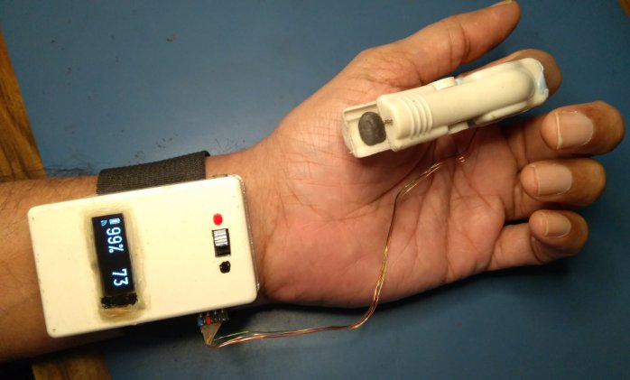

# ESP8266_SPO2_PULSE_LOGGER
 
The ESP8266 module reads raw sensor data from a MAX30102 
sensor at 25 samples/second. The samples are inserted into a circular buffer containing the last 125 samples (5 seconds of readings). SP02 and heart-rate are computed 25 times per second using Robert Fraczkiewicz's procedure.

Filtered readings are published to your personal subscription channel on the IOT website Thingspeak, with a configurable update interval. The minimum update interval is 15 seconds for a free Thingspeak subscription. You can view a 'real-time' chart of the data on your Thingspeak channel page.

WiFi internet access point SSID and password, ThingSpeak credentials and publishing interval are
configured via a webserver on a standalone WiFi Access Point. This WiFi AP is started up automatically if no SSID/password/credentials are stored. It is also available on-demand by pressing a configuration button after power-up.

A 128x32 OLED display is updated every 2 seconds with IIR-filtered SPO2 and heart-rate readings, battery level and WiFi internet access status. SPO2 and heart-rate readings continue to be displayed even if you have no internet access or fail to connect to your Thingspeak channel. In this case the Wifi icon will not be displayed.

## Hardware

* ESP8285 (ESP8266 with on-chip 1MB flash)
* 128x32 OLED display
* MCP73831 Lipoly charger
* 1000mAh Lipoly battery
* Home-brew MAX30102 breakout board. Modules are available on AliExpress.

Here's the [circuit schematic](docs/sp02_pulse_logger_schematic.pdf).

## Completed Unit

I used a clothes peg with some silicone putty to make a mold for my index finger. 
Note that if blood circulation
is restricted, you won't be able to get any readings. I replaced the original clothes peg spring with one made from a thin hacksaw wire blade. This reduced the closing force so it was just enough for a snug fit without slipping off. 



## Software Development Environment

* Ubuntu 20.04 on AMDx64
* Visual Studio Code + Platformio plugin using Espressif Arduino framework for ESP8285 platform. Previous versions used the Arduino IDE environment - the last Arduino IDE compatible source code is tagged as v0.9.


## Library Usage Notes

* MAX30102 sensor initialization and FIFO readout code 
[Sparkfun](https://github.com/sparkfun/SparkFun_MAX3010x_Sensor_Library)

* SPO2 & pulse rate measurement code by Robert Fraczkiewicz
[aromring's repository](https://github.com/aromring/MAX30102_by_RF). 
I modified the implementation to use a circular buffer with 125 samples

* WiFiManager SSID/password and ThingSpeak configuration magic [tzapu](https://github.com/tzapu/WiFiManager)

* [Arduino Json 5 library](https://github.com/bblanchon/ArduinoJson/tree/5.x). Note that
the Json 6 library uses a completely different API.

* [U8G2lib Arduino graphics library](https://github.com/olikraus/U8g2_Arduino)

* [ThingSpeak Arduino library](https://github.com/mathworks/thingspeak-arduino)

## RF auto-correlation algorithm versus FFT spectral analysis

Robert Fraczkiewicz's libary uses an auto-correlation algorithm on the sensor red led waveform to compute heart-rate. I've [archived](docs/RFA_versus_FFT_for_heartrate.zip) a project that uses FFT spectral analysis of the sensor red led waveform to compute heart-rate. 

## Usage

* Before flashing the very first time, select Platformio-> Project Tasks->Platform->Erase flash option to erase any existing
SPIFFS partitions and Wifi settings. 
Do this if you make any changes to the SPIFFS partition, configuration file structure, or are facing problems with IAP access after configuration.
* The ESP8266 reads a JSON configuration file in SPIFFS to retrieve the Thingspeak
parameters (channel number, write API key and update interval). If you just used the
"Flash Erase" option, the configuration file will not exist and the AP configuration portal will start up.
Connect to the WiFi access point with SSID "SPO2_HeartRate" within 90 seconds. On my
Ubuntu 20.04 machine, the configuration webpage automatically popped up in a separate browser window.
If that doesn't happen, open your browser and enter the url ```http://192.168.4.1``` to access the Wifi configuration page. Here you enter the 
Internet access point SSID/password, the Thingspeak channel number, API key and update interval (in seconds). The **minimum update interval** for a free ThingSpeak subscription is 15 seconds.
Save the settings. The ThingSpeak parameters will now be saved to a JSON configuration file
in the SPIFFS flash partition. The Internet Access Point SSID and password are saved in the Wifi settings flash area.

### AP Webserver home page


### Webserver configuration page (with flash completely erased)


* If you want to change the Internet Access point configuration SSID/PW or Thingspeak
credentials, wait for the display prompt just after start-up. Press the configuration button
and keep it pressed until you see display confirmation of the AP webserver startup.
Now connect to the webserver configuration page and make your changes.


* Battery level and WiFi status are shown on the left side of the display. If the unit cannot
connect to the last configured IAP, or cannot connect to ThingSpeak with 3 consecutive attempts, 
the Wifi radio is turned off and no WiFi icon will be displayed.

## Power management

With OLED display and WiFi on, the average current draw is ~75mA. With OLED display on and WiFi off, the average current draw
is ~30mA. 
To save power, the unit turns on the WiFi only when publishing an update to
the ThingSpeak website - this takes about 4-5 seconds.

Apparently, if you configure the unit with a static IP address in station mode, connecting
to the access point is faster. That would shorten the time required to publish an update.
But not all access points allow static configuration of IP
addresses - e.g. my phone in hotspot mode does not.

## Recoverable fault handling

* If unable to connect to the configured internet access point, the unit will disable
internet access and continue sensor sampling with OLED display of SPO2 and heart-rate.
* If unable to connect to the ThingSpeak website to publish updates with 3 consecutive
attempts, the unit will disable internet access
and continue sensor sampling with OLED display of SPO2 and heart-rate.

## Unrecoverable fault handling

The following error conditions are handled by 
shutting down the MAX30102 sensor, turning off the OLED display and switching the ESP8285 
into deep sleep mode.
This is done to save battery power. To recover, switch the unit off and on again. 

* Battery voltage is too low
* Unable to connect to or configure the MAX30102 sensor on power up
* Unable to detect valid SPO2/pulse readings for 1 minute


