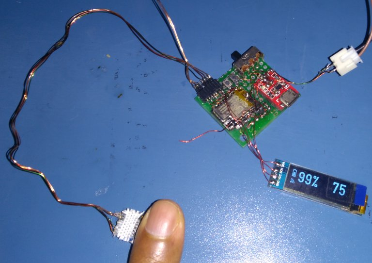

# ESP8266_MAX30102_SPO2_PULSE_LOGGER

The ESP8266 collects raw sensor data from a MAX30102 
sensor, analyzes it and computes SP02 and heart-rate (bpm) readings, every 4 seconds. 
The last 5 good readings are averaged and published (along with the battery voltage) to your 
channel on the IOT website Thingspeak. An RGB LED is used to indicate the heart-rate range.

## Development Environment

* Protoype board with ESP8285 (ESP8266 with on-chip 1MB flash), MCP73831 Lipoly charger, 1000mAh Lipoly battery.
* Home-brew MAX30102 breakout board. Modules are available on AliExpress.
* Arduino 1.8.12 on Ubuntu 20.04 amdx64

## Prototype

## Library Usage Notes

* MAX30102 sensor initialization and FIFO readout code from 
[Sparkfun](https://github.com/sparkfun/SparkFun_MAX3010x_Sensor_Library)

* SPO2 & pulse rate measurement code by Robert Fraczkiewicz from 
[aromring's repository](https://github.com/aromring/MAX30102_by_RF). I tweaked RF's implementation to use 50Hz sample rate. 

* WiFiManager SSID/password and ThingSpeak configuration magic by [tzapu](https://github.com/tzapu/WiFiManager)

* [Arduino Json 5 library](https://github.com/bblanchon/ArduinoJson/tree/5.x). Note that
the Json 6 library uses a completely different API.

## Usage

* The ESP8285 has 1MByte of on-chip flash memory. I had problems flashing the chip when
I selected "generic ESP8285" in the Arduino IDE. So I ended up selecting "generic ESP8266", 
(1MB with 64kB SPIFFS). If you are
using a regular ESP8266, choose a similar option (xMB with 64kB SPIFFS).
* When flashing the first time, select the flash "erase all" option to erase any existing
SPIFFS partitions and Wifi settings. Flash the application and then revert to "erase sketch only".
Do this if you make any changes to the SPIFFS partition, or are facing problems with IAP access after
configuration.
* The unit uses an RGB led to indicate status and errors.
* The ESP8266 reads a JSON configuration file in SPIFFS to retrieve the Thingspeak
parameters (channel number and write API key). If this is the first time (you used the
"erase all" flash option),
the AP configuration portal will start up, indicated by the LED turning yellow.
Connect to the WiFi access point with SSID "SPO2_HeartRate" within 90 seconds. On my
Ubuntu 20.04 machine, the configuration webpage automatically popped up in a separate browser window.
If that doesn't happen, open your browser and enter the url http://192.168.4.1 to access the Wifi configuration page. Here you enter the 
Internet access point SSID and password, and the Thingspeak channel number and API key.
Save the settings. The Thingspeak parameters will now be saved to a JSON configuration file
in SPIFFS. (The IAP SSID and password are saved in the Wifi settings flash area).
Reset or power cycle the unit for normal operation. 

### Portal home page

### Portal configuration page (with flash completely erased)

* If you want to change the Internet Access point configuration SSID/PW, or the Thingspeak
parameters, you can force the configuration portal to start by pressing the configuration button
connected to GPIO0 when you see the blinking magenta led on power-up. Keep it pressed until the LED
turns yellow. Now connect to the portal and make your changes.

### Normal usage : LED indicators if everything is working OK

* On power up, the unit checks the battery voltage and the LED will flash **MAGENTA** from 1 to 5 times (5 for
a fully charged battery, 1 for a discharged battery).
* After every 4-second measurement cycle the LED colour will indicate the heartrate range 
if the software is able to compute valid spo2 and heart-rate readings. If no reading was
possible (sensor disturbed etc.), the LED will be turned off.
	* **BLUE**  < 70bpm
	* **GREEN** 70-75bpm
	* **YELLOW** 75-80bpm 
	* **RED**    80-85bpm 
	* **MAGENTA** 85-90bpm 
	* **WHITE** >= 90bpm 
* The LED will turn off every time an update to Thingspeak channel is published. This
normally takes a few seconds. 
The updates are averaged values of the last 5 good measurements. So the minimum update
interval is 20s if all the sampling cycles produced good measurements. Note that the minimum
interval for publishing events to a free ThingSpeak subscription channel is 15 seconds.

## Power management

With WiFi on, the average current draw is ~70mA. With WiFi off, the average current draw
is ~22mA with LED indicator on. So after connecting to the internet
access point, the unit turns on the WiFi only when attempting to publish an update to
the ThingSpeak website.

So for every update event cycle, for ~20 seconds, the current draw is 22mA, and then for ~4 seconds, the current draw is 70mA.

Apparently, if you configure the unit with a static IP address in station mode, connecting
to the access point is faster. That would shorten the interval when the Wifi radio
is turned on. But not all access points allow static configuration of IP
addresses - e.g. my phone in hotspot mode does not.

## Recoverable fault handling

* If unable to connect to the last configured internet access point, the unit will
turn off WiFi and continue the sensor sampling with LED indication of heartrate range.
* If unable to connect to the ThingSpeak website to publish updates with 3 consecutive
attempts, WiFi will be turned
off and the unit will continue sensor sampling with LED indication of heartrate range.

## Unrecoverable fault handling

* The following error conditions are handled by blinking the LED for several seconds,
shutdown of the MAX30102 sensor, turn off the LEDs and going into deep sleep mode.
This is done to save battery power. To recover, switch the unit off and on again. The
fault source is indicated by the blinking LED colour.

* MAGENTA
	* Battery voltage is too low (fast blink)
* TURQUOISE 
	* Unable to connect to or configure the MAX30102 sensor on power up (fast blink)
	* Unable to detect valid SPO2/pulse readings for 1 minute (slow blink)

